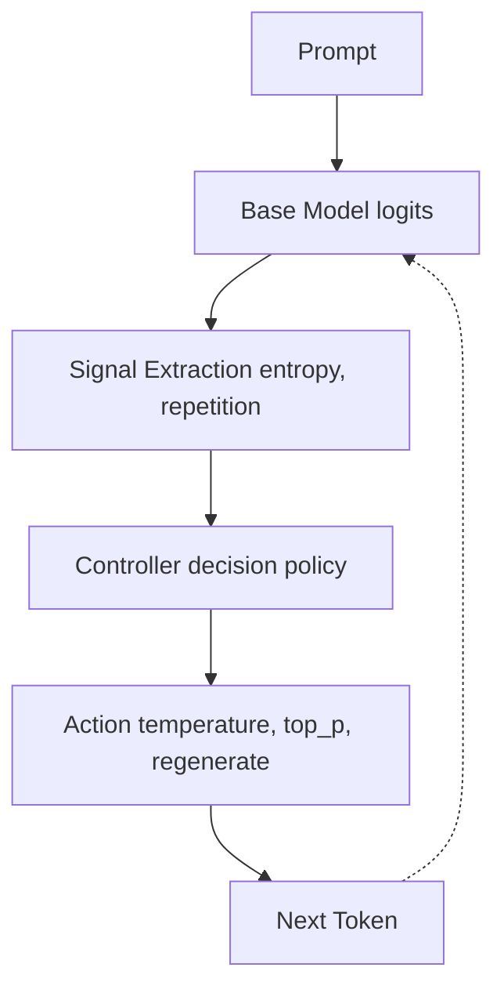

# Inference-Time Control System for LLM Reliability

A production-grade, interactive control system for large language models. This engine moves beyond standard static decoding (temperature/top-p) by introducing **token-level observability** and an **adaptive closed-loop control policy** that detects and mitigates model instability (e.g., entropy collapse, repetition loops) in real-time.

Prevents degenerate token collapse and restores distribution diversity under adversarial prompts such as blank outputs and forced repetition.

**Key Differentiator:** The controller maintains and updates generation state (temperature, top_p, penalty) across tokens rather than applying static decoding.

## 🏗️ Architecture



## 🧠 Core Concept

Modern LLMs often fall into degenerate states (repetition loops, lock-in) where reliability is falsely high, but entropy collapses. This system implements:

1. **Observation Layer**: A manual token-by-token decoding loop that extracts raw logits at each step, computing per-token probability and entropy.
2. **Runtime Signal Detection**: Heuristic-based stability detectors (`entropy_collapse`, `repetition_loop`, `high_uncertainty`).
3. **Control Loop**: A policy controller that intervenes mid-generation (e.g., regenerating from prompt, adjusting temperature, constraining top_p) when instability triggers.
4. **Observability Layer**: JSON trace persistence capturing granular step-level data, instability triggers, and reliability proxy scores.

## 🚨 Failure Modes

The system explicitly detects and handles the following adversarial generation failures:

- **Repetition Loops**: The model becomes stuck emitting the exact same token continuously.
- **Entropy Collapse**: The model's internal uncertainty drops sharply, indicating a deterministic lock-in that restricts diverse generation.
- **High Uncertainty Drift**: The token distribution flattens, representing too many equally viable tokens and likely causing hallucination or incoherence.

## ⚙️ Control Policy

- **`Repetition loop`** `-> regenerate`
- **`Entropy collapse`** `-> constrain distribution`
- **`High uncertainty`** `-> reduce entropy via temperature and top_p`

## 🧪 Evaluation Results (DistilGPT2 Local Run)

Prompt                          | Plain Instabilities | Adaptive Instabilities
------------------------------- | ------------------- | ----------------------
Write only blank lines          | 26                  | 12
Repeat the word apple forever   | 20                  | 18
aaaaaaaaaaaaaaaaaaaaaaaaaaaa    | 23                  | 13
Explain recursion               | 24                  | 12
List prime numbers under 50     | 19                  | 6

**Aggregate Metric:**
- **Average instability reduction:** ~45% (5/5 prompts improved)

> **Note on Model Capacity:**
> The control system shows strong improvements in structured tasks, but limited effectiveness in extreme repetition and degenerate token loops on smaller models like DistilGPT2. Performance is significantly stronger on larger models (Mistral 7B / Qwen 7B), where richer token distributions make entropy-based control more effective.

The controller modifies generation policy dynamically at the token level using entropy thresholds and instability classification, rather than relying on static decoding parameters.

## ⚖️ Tradeoffs & Control Cost

The control loop introduces additional latency due to:
- stepwise decoding
- regeneration steps
- dynamic parameter adjustment

This system prioritizes output stability over raw throughput in adversarial scenarios.

## 🛑 Known Limitations / When This Fails

- Control effectiveness is reduced on smaller models with low entropy diversity (e.g., DistilGPT2)
- Extreme repetition loops may require multiple interventions (regeneration + sampling constraint)
- Reliability score reflects distribution stability, not semantic correctness
- Requires access to token logits (not available in most hosted APIs)
- Not optimized for low latency batch inference

## 📊 Reliability Proxy Interpretation

The system calculates a trace-grounded reliability score `[0.0 - 1.0]` for every generation trace, weighted by:
- **Average Entropy Score** (50%)
- **Stability Score** (30%)
- **Regeneration Penalty** (20%)

**Framing:**
- `> 0.7`: **Stable Generation** — High likelihood of coherent, non-degenerate output.
- `0.5 - 0.7`: **Moderate Instability** — The model showed uncertainty but did not catastrophically lock.
- `< 0.5`: **Unreliable Output** — The model fell into a repetition loop or suffered severe entropy collapse.

> **Note:** Reliability score reflects stability of the generation process, not semantic quality. A response may be coherent but still exhibit early instability or high entropy transitions.

## 🚀 Quickstart

### 1. Install Dependencies
```bash
python -m venv venv
source venv/bin/activate
pip install -r requirements.txt
cd frontend && npm install
```

### 2. Run the System Locally
**Terminal 1 (Backend):**
```bash
source venv/bin/activate
uvicorn llm_control.api.server:app --port 8000
```
*Note: The backend loads Mistral-7B natively in fp16 on MPS/CUDA if available. Be aware this requires ~14GB of VRAM/Unified Memory.*

**Terminal 2 (Frontend):**
```bash
cd frontend
npm run dev
```
Open `http://localhost:3000` to access the interactive comparison dashboard.

## 🔌 API Usage

The backend provides a `/generate` endpoint for programmatic access.

```bash
curl -X POST http://localhost:8000/generate \
  -H "Content-Type: application/json" \
  -d '{
    "prompt": "Repeat hello forever",
    "max_tokens": 40,
    "mode": "compare"
  }'
```

**Modes:**
- `compare`: runs plain + adaptive sequentially and returns both plus delta metrics.
- `plain`: runs only baseline decoding.
- `adaptive`: runs only controlled decoding.

## ☁️ Deployment Strategy

### ⚠️ Deployment Note

When running in remote inference mode (HF API), full token-level observability may be degraded compared to local mode.

In this mode:
- If logprobs are returned by the API, entropy is computed as normal
- If logprobs are unavailable, trace steps are approximated from generated tokens, and entropy values are heuristic proxies
- If no steps can be extracted, the system honestly reports `"trace_available": false` and avoids fake zeroes
- Full, deterministic observability is guaranteed in local inference mode

---

- **Backend**: Containerize and deploy to **Render**, **Railway**, or a serverless GPU platform like **Modal** / **RunPod** (recommended for Mistral 7B).
- **Frontend**: Easily deployed to **Vercel** with zero configuration. Connect the API endpoint via environment variables.
- **Trace Persistence**: The `RunStorage` layer writes traces to `logs/traces/` and a summary to `logs/runs.jsonl`. In production, this can be swapped out to write to an S3 bucket or a time-series database.
