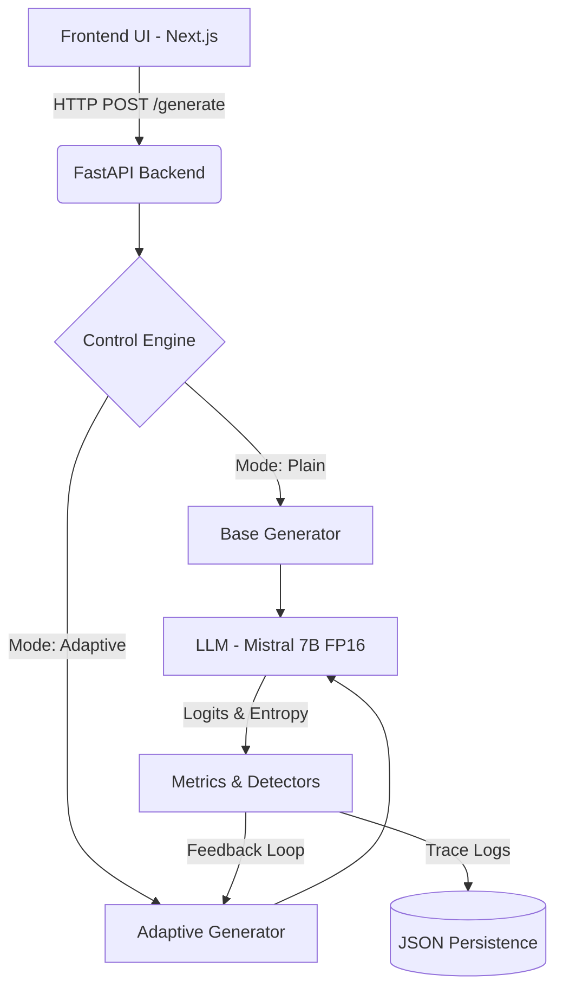

# LLM Generation Control Engine

A production-grade, interactive control system for large language models. This engine moves beyond standard static decoding (temperature/top-p) by introducing **token-level observability** and an **adaptive closed-loop control policy** that detects and mitigates model instability (e.g., entropy collapse, repetition loops) in real-time.

## 🧠 Core Concept

Modern LLMs often fall into degenerate states (repetition loops, lock-in) where confidence is falsely high, but entropy collapses. This system implements:

1. **Observation Layer**: A manual token-by-token decoding loop that extracts raw logits at each step, computing per-token probability and entropy.
2. **Detection Layer**: Heuristic-based stability detectors (`entropy_collapse`, `repetition_loop`, `low_entropy_lock`).
3. **Control Layer**: A policy controller that intervenes mid-generation (e.g., regenerating from prompt, adjusting temperature) when instability triggers.
4. **Observability Layer**: JSON trace persistence capturing granular step-level data, instability triggers, and confidence scores.

## 🏗️ Architecture



## 🚀 Quickstart

### 1. Install Dependencies
```bash
python -m venv venv
source venv/bin/activate
pip install -r requirements.txt
cd frontend && npm install
```

### 2. Run the System Locally
**Terminal 1 (Backend):**
```bash
source venv/bin/activate
uvicorn llm_control.api.server:app --port 8000
```
*Note: The backend loads Mistral-7B natively in fp16 on MPS/CUDA if available. Be aware this requires ~14GB of VRAM/Unified Memory.*

**Terminal 2 (Frontend):**
```bash
cd frontend
npm run dev
```
Open `http://localhost:3000` to access the interactive comparison dashboard.

## 📊 Confidence Metric Interpretation

The system calculates a single confidence score `[0.0 - 1.0]` for every generation trace, weighted by:
- **Average Entropy Penalty** (50%)
- **Instability Event Penalty** (35%)
- **Regeneration Penalty** (15%)

**Framing:**
- `> 0.7`: **Stable Generation** — High likelihood of coherent, non-degenerate output.
- `0.5 - 0.7`: **Moderate Instability** — The model showed uncertainty but did not catastrophically lock.
- `< 0.5`: **Unreliable Output** — The model fell into a repetition loop or suffered severe entropy collapse.

## 🔌 API Usage

The backend provides a `/generate` endpoint for programmatic access.

```bash
curl -X POST http://localhost:8000/generate \
  -H "Content-Type: application/json" \
  -d '{
    "prompt": "Write only blank lines",
    "max_tokens": 40,
    "mode": "adaptive"
  }'
```

**Response format:**
```json
{
  "output": "...",
  "steps": [
    {
      "token": "\\n",
      "entropy": 0.324,
      "instability": "entropy_collapse"
    }
  ],
  "confidence": 0.73,
  "regenerations": 1
}
```

## ☁️ Deployment Strategy

- **Backend**: Containerize and deploy to **Render**, **Railway**, or a serverless GPU platform like **Modal** / **RunPod** (recommended for Mistral 7B).
- **Frontend**: Easily deployed to **Vercel** with zero configuration. Connect the API endpoint via environment variables.
- **Trace Persistence**: The `RunStorage` layer writes traces to `logs/traces/` and a summary to `logs/runs.jsonl`. In production, this can be swapped out to write to an S3 bucket or a time-series database.
